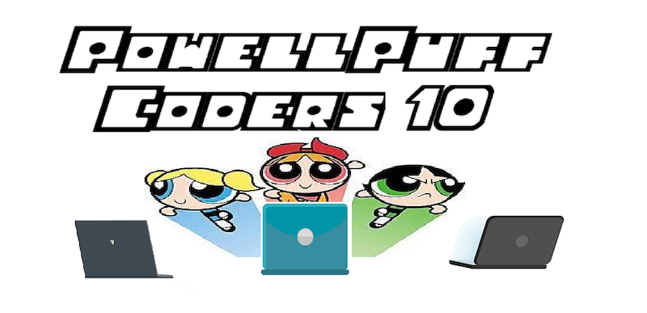

# The PowellPuff Coders' Team Page

We are the PowellPuff Coders! Our goal is to create a Bullet Journal that allows users to make their work more focused and productive. Our core skills and values include communication, perseverance, and honesty. But the most important ingredients to our success is of course, sugar, spice, and everything nice! These ingredients combined with our most important feature, **our Chemical X: Agile**, to make us completely unstoppable. 

## Meet the Team!

### Akar Singh

Hey! I'm Akar (Singh), a 2nd year Computer Engineering major. In my free time I like to read manga and play video games. Right now I have a bit of an obsession over automation, usually spending more time writing scripts than using them.

https://maniacalhamster.github.io/CSE110-L1/

### Akhilan Ganesh

Hi, I'm Akhilan Ganesh. I'm a second year CS major. I like to play videogames, read non-fiction books, meditate, and watch anime. I don't have a perfect job/dream to work for/in, but I hope that with the skills I learn from college I can build scalable and dependable software or other technologies that can economically uplift the most marginalized. I am also considering an education route since I like teaching things. I don't want to do only one thing for my whole career.

https://akhilanganesh.github.io/cse110-lab1/

### Asya Balas

Hey, I'm Asya, a 2nd year CS major, minoring in Econ and Chinese Studies. In my free time you can find my reading, listening to music, and doing any sorts of crafts really. I'm interested in linguistics and learning more about being a software engineer, and who knows, possibly combining the two!

https://asya-balas.github.io/Lab1/

### Brian Tran

Hello, my name is Brian Tran. I'm a second year ECE major from Marshall college. My hobbies consist of playing basketball, tennis, games, and cooking (but very little). I'm not really sure what I truly want to do yet since I am taking both EE and CS courses, but I hope I can figure that out soon.Hello, my name is Brian Tran. I'm a second year ECE major from Marshall college. My hobbies consist of playing basketball, tennis, games, and cooking (but very little). I'm not really sure what I truly want to do yet since I am taking both EE and CS courses, but I hope I can figure that out soon.

https://bgt002.github.io/CSE110/

### Ivan Ozerets

Hello, my name is Ivan Ozerets. I'm a third year CS major at Sixth. My academic interests include machine learning and AI. On my free time I enjoy playing tennis, practicing random skills, and reading fiction. I don't have a dream job at the moment, mainly because I'm not certain what my CS focal interest is yet, but I'm hoping it will be machine learning when I get around to it!

https://ivanozerets.github.io/ivanOzerets-Repo/

### Nathan Rinker

Hi, my name is Nathan Rinker, I am a third year Computer Science major from Sixth College. I'm interested in the world of UX/UI and am aiming for a career in Front-End Development and Design. My hobbies include video games, watching twitch streams and anime, and playing tabletop role-playing games with my friends.

https://njrinker.github.io

### Praneet Bhoj

Hi, I’m Praneet! I’m a 2nd year student in Warren College, and I’m majoring in Computer Science and minoring in Physics. In my free time, I love playing video games on my Xbox, playing basketball and watching a bunch of different sports (mostly basketball, football, and soccer). I’m interested in possibly becoming a backend engineer, so I look forward to improving my software engineering skills!

https://praneetbhoj.github.io

### Ryan Shamoon

Hello, my name is Ryan Shamoon, I am third year Computer Science major from Muir College. I am interested in pursing sports data analysis, which I think comes from my love of fantasy sports. When I am not doing Computer Science, I normally like playing games with family and friends, including video games like Super Smash Bros and card games like Exploding Kittens.

https://rshamoon.github.io/cse110/

### Thanh Huy Le

Hi, I’m Thanh Huy Le, first name Huy. I’m a 4th year at Revelle College and an international student from Vietnam, majoring in Computer Science. My hobbies include gaming, cooking, long walks, meditation, and sleeping in. I’m interested in not being unemployed.

