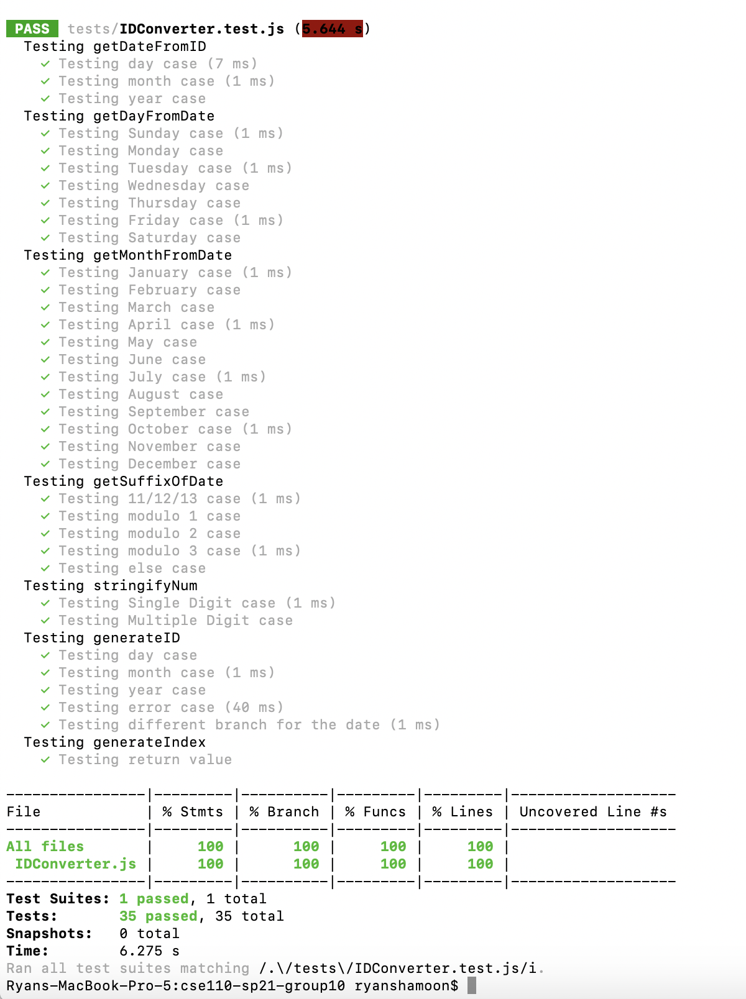
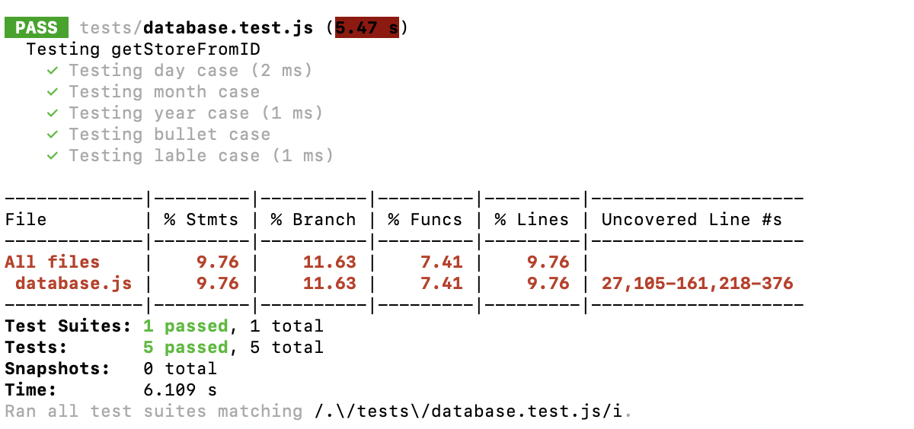
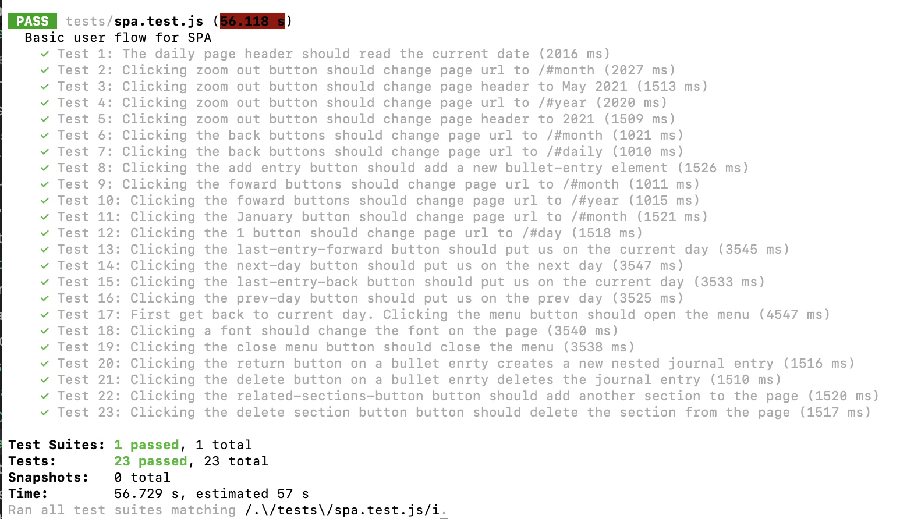

# Testing Documentation

## Unit Testing

To do unit testing, we used jest.

Most of the functions used in our project access the DOM or the Database. As a result, many of them we could not test without jest complaining that the window or Database could not be accessed. As a result, not many functions were unit tested. The file IDConverter.js was where we stored most methods that handled ID creation, reading, and modification. Because none of these files access the window or database, we unit tested all of them. Here is our coverage report indicating full coverage of this file:

database.js only contained one function that could be unit tested because the rest access the database, which caused problems. This function would getStoreFromID, for which we got full coverage.

## End to End Testing

To test all the functions we could not test using unit testing, we used jest-puppeteer for End to End testing. 

This means we called these functions that access the window and the database and measured the effects by monitoring page elements. This includes testing all the bullet functionality, text change, and spa functionality. Here is a summary of all of the tests:

## Summary

Between unit testing and end to end testing using jest and jest-puppeteer respectively, we have sucessfully tested most of the functions and functionality of our program using automated testing. These tests are also integrated into the CI Pipeline. 